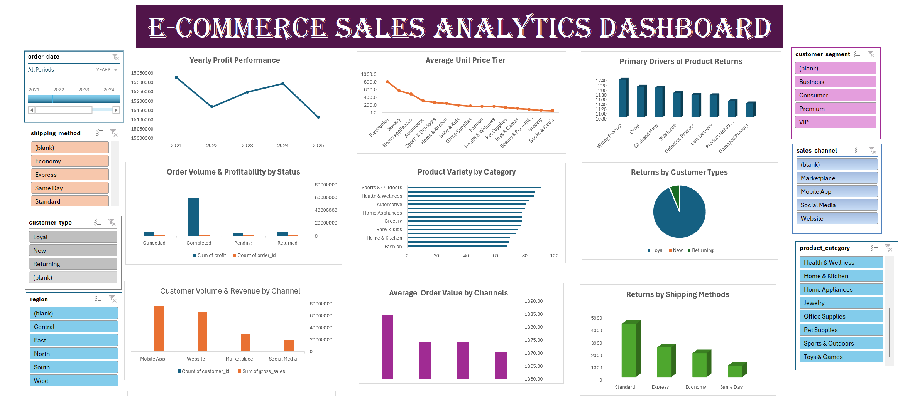

# Data Analytics Project Portfolio
# Project 1

**Title:** E-COMMERCE SALES ANALYTICS DASHBOARD																	

**Tools Used:** Microsoft Excel (Pivot table, Pivot Chart, Slicers, Timelines, Power Query Editor)

**Project Description:** This project features a comprehensive E-Commerce Sales Analytics Dashboard developed to track, analyze, and visualize core business metrics for an online retail platform. Built using Microsoft Excel and leveraging advanced features like Power Query Editor, Pivot Tables, Pivot Charts, and interactive elements (Slicers & Timelines), this tool transforms raw transactional data into actionable operational insights. It empowers stakeholders to monitor financial performance, evaluate customer behavior, analyze product categories, and optimize shipping and sales channels.

**Key findings:**

**- Yearly Profit Performance Decline:** Financial performance peaked in 2021, followed by a noticeable downward trend into 2024 and 2025, indicating a critical need to investigate rising costs or changing market conditions

**- Dominant Customer Channels:** The Mobile App closely followed by the Website stand out as the primary driver for both customer volume and revenue, significantly outperforming marketplace and social media.

**- Top Drivers of Product Returns:** Wrong products remain the leading cause of customer returns, highlighting a clear area for quality control.

**- High-Performing Product Categories:** Sports & Outdoors closely trailed by Health & Wellness emerged as the top product varieties by category volume, capturing a massive share of the inventory movement.

**Dashboard Overview:** The layout is structured into highly scannable grid components divided by strategic business pillars:

**- Interactive Filters (Left Panel):** Includes multi-select Slicers and Timelines for Order Date, Shipping Method, Customer Type, and Region, allowing users to dynamically slice data across the entire sheet.

**- Segment Breakdown (Far Right Panels):** Includes auxiliary filters and data groupings dedicated to Customer Segment, Sales Channel, and Product Category.

# Project 2

**Title:** Workplace Safety Data Interrogation

**SQL Code:** [Workplace SQL Data interrogation and Manipulation](https://github.com/seunogunjobi710/seunogunjobi710.github.io/blob/main/Workplace.sql)

**SQL Skills Used:**

**- Data Retrieval (SELECT):** Queried and extracted specific information from the database.

**- Data Aggregation (SUM, COUNT, AVG):** Calculated total financial impacts, frequency metrics, and performance averages to benchmark safety data trends.

**- Data Filtering (WHERE, BETWEEN, IN, AND):** Applied logic constraints to filter out specific subsets of data, matching exact string identifiers like incident types and report classifications.

**- Data Source Specification (FROM):** Specified the tables used as data sources for retrieval

**- Data Sorting & Limiting (ORDER BY, TOP):** Organized data subsets sequentially and restricted outputs to extract extreme boundary values (e.g., highest costs, most frequent occurrences).

**- Data Categorization (GROUP BY):** Segmented records across operational variables such as plants, shifts, departments, age groups, and timeline markers.

**Project Description:** This project focuses on a comprehensive relational database interrogation of enterprise Workplace Safety Data using Microsoft SQL Server. The objective is to extract strategic, data-driven safety insights from raw operational logs. By executing aggregate queries, conditional filtering, and structural sorting, the scripts uncover underlying patterns regarding incident frequencies, financial liabilities, regional exposures, and demographic risk factors. These queries transform standard safety logs into actionable intelligence, enabling safety officers to optimize risk mitigation protocols, balance shift workloads, and minimize organizational financial losses.

**Technology used:** SQL server
